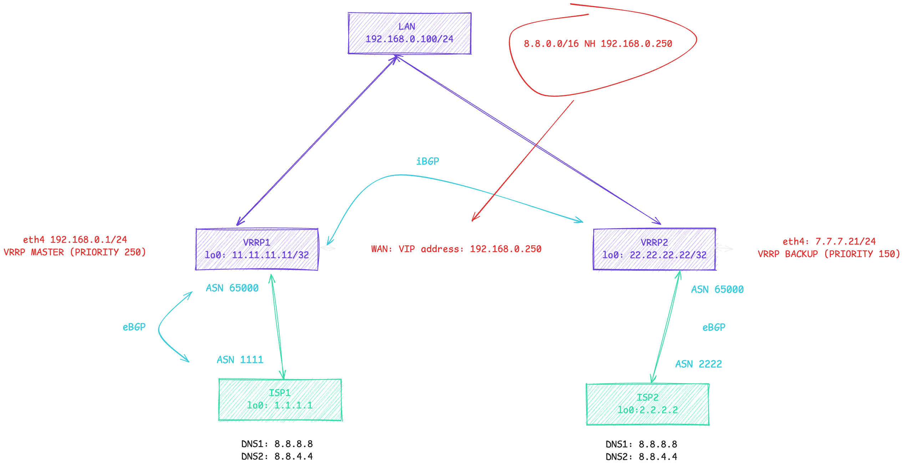

# 🛡️ VRRP + Connectivity Tracking na Arista EOS  
## Automatyczne przełączanie priorytetu VRRP na podstawie osiągalności DNS Google (8.8.8.8)

📌 **Schemat labu:**  


---

## 🧠 Idea działania  
W zależności od tego, czy dany adres w Internecie (tu: **DNS Google 8.8.8.8**) jest osiągalny, przełączamy priorytet VRRP między dwoma routerami.  
Arista EOS nie posiada natywnie mechanizmu podobnego do Cisco IP SLA, a tracking VRRP potrafi obniżyć priorytet **tylko w przypadku padnięcia interfejsu**.

Dlatego używamy **Connectivity Monitor** + **Event-Handler**, aby dynamicznie manipulować priorytetem VRRP.

---

# 🧪 LAB – konfiguracja krok po kroku

---

## 1️⃣ Konfiguracja VRRP na VRRP1 i VRRP2

```bash
VRRP1(config-router-bgp)# sh run interfaces ethernet 4
interface Ethernet4
   description to_LAN
   no switchport
   ip address 192.168.0.1/24
   vrrp 1 priority-level 250
   vrrp 1 ipv4 192.168.0.250
   vrrp 1 ipv4 version 3
```

📊 **Status:**

```bash
VRRP1(config-router-bgp)#sh vrrp brief 
Interface VRF        ID  Ver Pri Time  State  Last Transition     VR IP Addresses 
--------- ---------- --- --- --- ----- ------ ------------------- ---------------
Et4       default    1   3   250 3020  Master 00:02:28 ago        192.168.0.250
```

---

## 2️⃣ Konfiguracja Connectivity Monitor + Event-Handlers ⚙️

### 🔍 Monitorowanie dostępności DNS Google

```bash
monitor connectivity
   interval 5
   no shutdown
   interface set int_to_ISP2 Ethernet2
   !
   host DNS
      description "ping do DNS google 8.8.8.8"
      local-interfaces int_to_ISP2 address-only
      ip 8.8.8.8
!
```

### 📉 Event-handler gdy DNS jest *niedostępny*

```bash
event-handler DNS_google_DOWN
   action bash Cli -p15 -c $'enable
 configure
 interface Ethernet 4
 vrrp 1 priority-level 50
 end'
   trigger on-logging
      regex DNS.*8.8.8.8* is unreachable .*Ethernet2
!
```

### 📈 Event-handler gdy DNS wraca *online*

```bash
event-handler DNS_google_UP
   action bash Cli -p15 -c $'enable
 configure
 interface Ethernet 4
 vrrp 1 priority-level 150
 end'
   trigger on-logging
      regex DNS.*8.8.8.8* is reachable .*Ethernet2
!
```

### 📊 Podgląd monitoringu:

```bash
VRRP1#sh monitor connectivity 
IP Address Local Interface  Latency  Jitter Packet Loss Probe Error
8.8.8.8    Ethernet1        0.229 ms 0.02 ms          0% n/a
```

---

## 3️⃣ Symulacja awarii: DNS Google przestaje odpowiadać 💥

Wyłączamy na ISP1 interfejs Loopback z adresem 8.8.8.8/32:

### 🔹 Przed:

```bash
VRRP1# sh ip bgp
* > 8.8.8.8/32  via 10.10.10.1
*   8.8.8.8/32  via 192.168.0.2
```

### 🔹 Komenda:

```bash
ISP1(config-if-Lo88)#shutdown
```

### 🔹 Po:

```bash
VRRP1# sh ip bgp
* > 8.8.8.8/32  via 192.168.0.2
```

### 📉 Connectivity Monitor:

```bash
8.8.8.8  Ethernet1   n/a  n/a  100%  Network is unreachable
```

---

## 4️⃣ Automatyczne przełączenie VRRP 🔄

```bash
Dec 12 12:49:17 ConnectivityMonitor: Host DNS (8.8.8.8) is unreachable
Dec 12 12:49:37 EventMgr: Event handler DNS_google_UP activated
Dec 12 12:49:40 VRRP: Ethernet4 Grp 1 state Backup -> Master
```

📉 VRRP spada z 250 → 50:

```bash
VRRP1#sh vrrp brief
Et4  default  1  3  50  Backup
```

---

## 5️⃣ Powrót DNS – VRRP odzyskuje priorytet 🔁

```bash
ISP1(config-if-Lo88)#no shutdown
```

```bash
VRRP1#sh vrrp brief
Et4 default 1 3 250 Master
```

Logi:

```bash
Dec 12 12:58:50 Event handler DNS_google_UP activated
Dec 12 12:58:54 VRRP: Ethernet4 Grp 1 state Backup -> Master
```

---

# 🎉 Podsumowanie  
Dzięki użyciu **Connectivity Monitor** + **Event-Handler**, Arista EOS może zachowywać się jak Cisco IP SLA i dynamicznie manipulować priorytetami VRRP, w oparciu o rzeczywistą osiągalność usług internetowych.  
Skutecznie tworzymy **inteligentny failover WAN**.

Enjoy! 🚀
